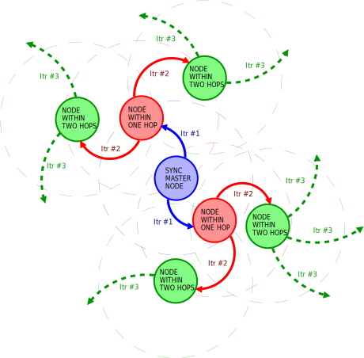
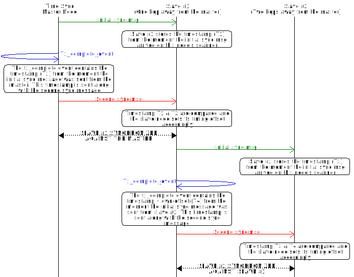
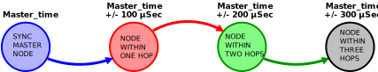

# Time syncronization model

The time syncronization models purpose is to give devices in a mesh network a common consept of time.  Use this model as a basic tool in applications that requires timing sensitive actions between different devices in the mesh network.

**Table of contents**

- [Properties and features](@ref time_sync_properties_features)
- [Implementing the model](@ref time_sync_implementing)
- [Message format](@ref time_sync_message_format)
  - [Initial sync message](@ref time_sync_message_format_initial)
  - [Secondary sync message](@ref time_sync_message_format_secondary)
  - [Time sync reset message](@ref time_sync_message_format_reset)
  - [Message opcodes](@ref time_sync_message_format_opcodes)

The syncronization primitive this model utilizes is based on a itterative process, where the same two-message broadcast action is repeated until the entire network has been syncronized. In figure 1 we can see an example of this itterative process. The sync master node starts the first itteration by broadcasting to the two nodes (red) within radio proximity, syncronizing them to itself. In the following itteration these nodes will then repeat the same action and syncronize all nodes (green) within their proximity, and thus it goes on until the entire network is syncronized.

To prevent that a sync message travels backwards (e.g. Sync_master->**Node_within_one_hop->Sync_master**) every message is equiped with a Transaction ID (TID). A model instance can only accept an incomming sync message as long as its TID is greater than the TID of the last successful sync message that instance recieved.

Figure 2 shows a detailed sequence chart of the message passing during two itterations of a syncronization session. Here we can see that the first itteration consists of two sequential messages sent from the master node to slave #1. Together these two messages creates a timestamp pair on the slave that is used to calculate the offset the slave needs to copensate for in order to be in sync with the master. As soon as slave #1 is in sync with the master, it will start the next itteration where it will synchronize slave #2.

---

## Properties and features @anchor time_sync_properties_features

The ID of the time sync model is 0x0026.

The time sync model is implemented as a single controller model.

All messages used in this model is broadcasted without any form of aknowledgement. The lack of aknowledgement implies that there is a chance that a single syncronization session may not syncronize every single device in the mesh network. However, due the nature of the relaying mecanisms in the model this would be unlikely in a network with a healthy distrubution of nodes.

The precision of the syncronization between two devices can be expected to be in the range of +/- 100 microseconds. In that regard it is important to note that this unaccuracy will scale with the number of hops between the master node and the node in question as demonstrated in Figure 3.

---

## Implementing the model @anchor time_sync_implementing

Before implementing the model, take note of the following requirements:

- All instances of this model must publish and subscribe to the same group address in the mesh.
- There can only be one instance of the time sync model on each device.
- The publish period of all models must be set to zero (disabled). The only exeption to this is for the master sync node if you are using the optional feature of periodic syncronization.

@note
The steps that mention the API functions after the initialization and the allocation steps
(steps 1 and 2) are traditionaly handled by the @ref CONFIG_MODEL through a configuration device, but are reported here for
the alternative hardcoded configuration of each device.

To implement the time sync model on a device:
-# Initialize the model with the `time_sync_controller_init()` function from the model API.
-# Allocate a subscription list with the `access_model_subscription_list_alloc()` API function.
-# Bind and set the application key for the model with the `access_model_application_bind()`
and the `access_model_publish_application_set()` API functions.
-# Set the publication address for the model with the `access_model_subscription_add()` API function.
-# Set the subscription address for the model with
the `access_model_publish_address_set()` API function.
-# (optional) If you want a to set a device as the deafault sync master with a periodic syncronization interval, Set the publication period for the model on your choosen master node with the `access_model_publish_period_set()`
API function.

---

## Message format @anchor time_sync_message_format

The Time sync model uses the following types of messages:

- Initial sync message
- Secondary sync message
- Time sync reset

### Initial sync message @anchor time_sync_message_format_initial

This message is primarily used to generate a timestamp pair for the sender and the reciever. Secondarily it is used to pass compensation data and metadata.

| Member name  | Type     | Description                                                                                                                                      |
|--------------|----------|--------------------------------------------------------------------------------------------------------------------------------------------------|
| session_tid          | uint8_t  | Transaction ID used to identify each induvidual syncronization session.                                                                          |
| time_comp_per_chan | uint16_t | Compensation value in micro seconds for a single channel. Used as the increment value when compensting for which channel the message arrived on. |
| hop_ctr      | uint8_t  | Shows how many hops the message has made since it was sent from the sync master.                                                                 |

### Secondary sync message @anchor time_sync_message_format_secondary

This message is used to convey the timestamp generated by the initial message from the initial sender to the reciever.

| Member name   |  Type    | Description                                                |
| ------------- | -------- | ---------------------------------------------------------- |
| timestamp | uint32_t | The timestamp of the sender at the moment it sent the corresponding initial sync messsage.       |
| session_tid         | uint8_t | Transaction ID used to identify each induvidual syncronization session. |

### Time sync reset message @anchor time_sync_message_format_reset

This message is used to reset the time sync model on all devices in a network.  

| Member name  | Type  | Description           |
| ------------ | ----- | --------------------- |
|      -       |   -   | This message is empty.|

### Message opcodes @anchor time_sync_message_format_opcodes

| Message name            | Opcode  | Direction of message     |
| ----------------------- | ------- | ------------------------ |
| Initial sync message         | 0x00F6  | Controller -> Controller |
| Secondary sync message         | 0x00F7  | Controller -> Controller |
| Time sync reset message | 0x00F8  | Controller -> Controller |
